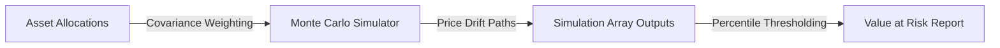

# 🏦 End-to-End Quantitative Portfolio Risk Analyzer

An algorithmic trading and risk infrastructure built to evaluate multi-asset portfolio distributions, compute daily volatility matrices, and calculate quantitative Value at Risk (VaR) parameters.

## 📊 Quantitative Workflow Engine


## 📈 Simulated Trajectory Distribution Bounds
The analyzer projects asset distributions under simulated pricing shock constraints. The model maps potential portfolio value degradation to determine loss limits (VaR (95%)):
## 🛠️ Financial Computing Stack
- **Language Environment:** Python 3.11
- **Computational Math Library:** NumPy Array Projections
- **Pipeline Quality Assurance:** Pytest Matrix Checkpoints

## 💻 Local Workspace Run
```bash
git clone https://github.com
cd portfolio-risk-analyzer
pip install pytest
pytest
```
